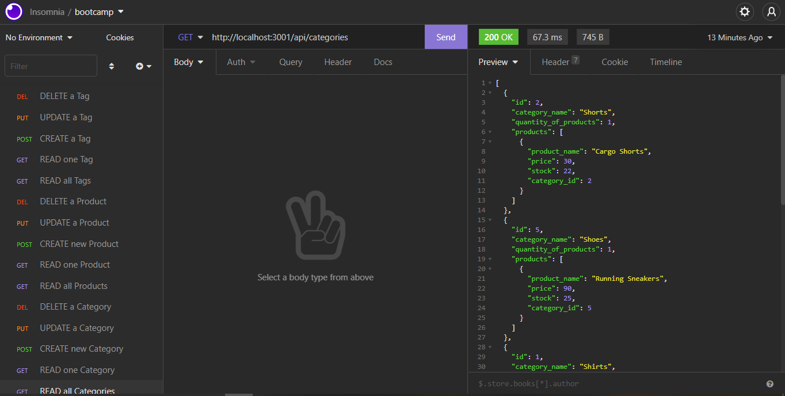
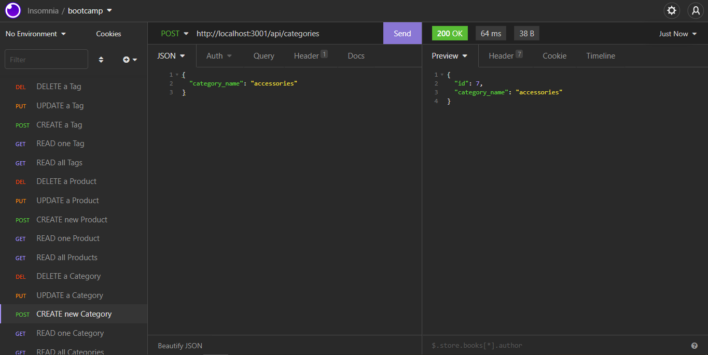
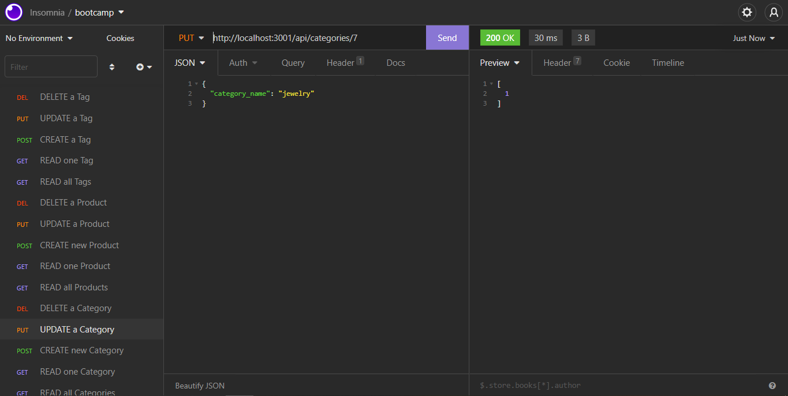
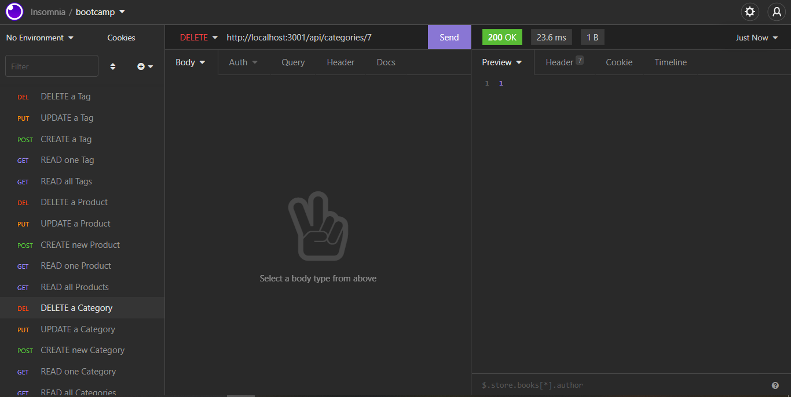

# E-Commerce (back-end) 

## Description
This E-Commerce node application is just a demonstration of the back-end functionality of an Express.js API configured to use Sequelize to interact with a MySQL database.

## Table of Contents
* [Installation](#installation)
* [Usage](#usage)
* [Contributing](#contributing)
* [Questions](#questions)
* [Deployed Application](#deployed-application)

## Installation
To install this application, go to the GitHub repository and download the zip file (or clone the code if you like), and run the following commands in your terminal at the root directory of the project: 'npm install', 'npm seed' (note: if you would like to seed the database yourself, you can skip the second command but there are seeds provided to get the application running quicker). You can then run 'npm start' from the terminal to open the port and start using a client of your choice to interact with the database (I used Insomnia, as shown in the screen shots).

## Usage
Create API calls in your client as shown below using the API routes. You can perform any CRUD operations you'd like for the models 'Category', 'Product', and 'Tag'.

## Contributing
This is an open source project and as such, please follow the [Contributor Covenant](https://www.contributor-covenant.org/).

## Questions
Check out my GitHub profile [here!](https://www.github.com/spaghettimedic) I can be reached directly at dsteiner247@gmail.com should you have any questions.

## Deployed Application
https://github.com/spaghettimedic/e-commmerce-backend